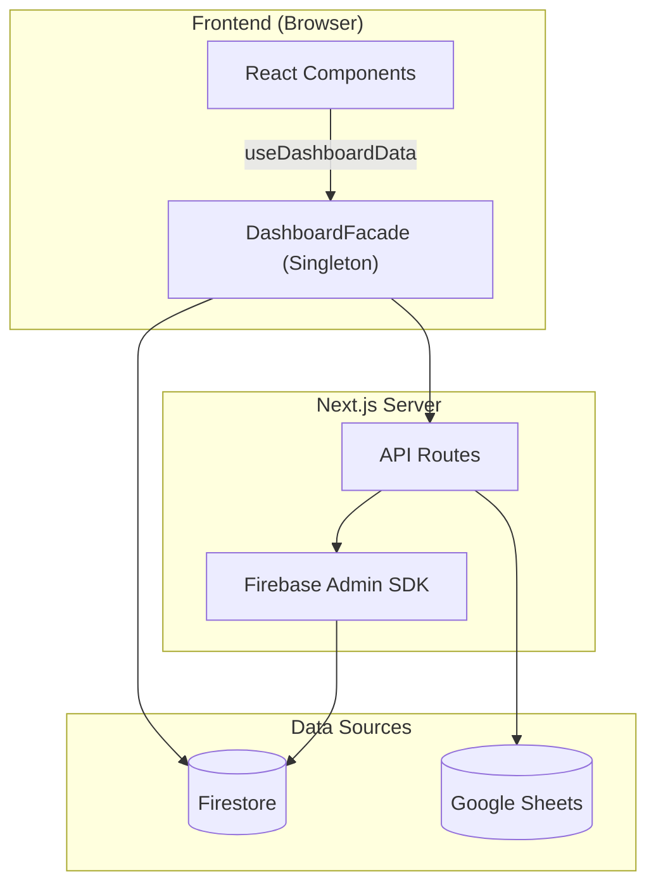

# 📋 PORTFOLIO D-VIEW — Engineering Report
> **Date**: 2026-03-26 | **Grade**: A | **Branch**: master | **Status**: Active Development & Stabilization


---

## 1. Executive Summary (프로젝트 요약)
- **부동산 임장 및 밸류에이션 리포팅 허브**: 동탄 지역을 중심으로 실거래가, 아파트 단지 정보, 유저의 현장 검증(임장) 데이터를 통합하는 종합 부동산 인텔리전스 플랫폼.
- **실시간 데이터 동기화 파이프라인**: Google Sheets(마스터 데이터) 및 Firebase Firestore 이중 사용.
- **Facade 및 Repository 패턴**: Data Layer, Service Layer, 비즈니스 로직(Facade) 분리 아키텍처.
- **고도화된 시각화 및 UX**: 3D 지식 그래프, Recharts 인터랙티브 차트, 반응형 모달 시스템.

---

## 2. Tech Stack (기술 스택)

| 분류 | 기술 | 비고 |
|:---|:---|:---|
| **Frontend** | Next.js (App Router), React | 16.1.6 Turbopack |
| **Language** | TypeScript | strict type |
| **Styling** | Tailwind CSS, Lucide React | 디자인 토큰 |
| **DB & Auth** | Firebase (Firestore, Auth, Storage) | 실시간 리스너 |
| **External Data** | Google Sheets API | SSOT |
| **Visualization** | Recharts, 3d-force-graph | 차트 + 3D 매핑 |
| **State** | React Hooks, Singleton Facade | globalThis 패턴 |
| **Testing** | Jest, ts-jest | 45 assertions / 5 suites |
| **Markdown** | react-markdown, remark-gfm, mermaid | Admin 보고서 |

---

## 3. Codebase Metrics

- **Source Files**: 101개 (src/)
- **LOC**: ~23,900
- **Components**: 23개 (Card, Modal, Chart, Consumer, Admin, Map 등)
- **API Routes**: 13개
- **Repositories**: 7개 핵심 모듈 (apartment·comment·post·purchase·report·review·user)
- **Admin Pages**: 4개 (대시보드, 아파트 상세, 종합 보고서, 트래픽 분석)
- **Test Suites**: 5개 / 89 assertions 전수 통과 (단, UI 컴포넌트 커버리지 0%)

---

## 4. Architecture

### 데이터 흐름도



### 디렉토리 구조
```
src/
├── app/
│   ├── api/              # API 엔드포인트
│   ├── admin/            # 관리자 (대시보드, report)
│   └── page.tsx          # 메인 페이지
├── components/
│   ├── admin/            # ReportEditorForm 등 관리자 전용
│   ├── consumer/         # AdvancedValuationMetrics, RawMetricsSection, DynamicSimulator 등
│   ├── map/              # GoogleMap, MapProvider
│   └── ui/               # ApartmentModal, Card, Filter, Comment
└── lib/
    ├── repositories/     # Firebase DAO
    ├── services/         # KPI, Logger
    ├── utils/            # apartmentMapping 정규화 엔진
    └── DashboardFacade.tsx
```

---

## 5. Feature Inventory

| 도메인 | 기능 | 라우트/DB | 설명 |
|:---|:---|:---|:---|
| **Property** | 아파트 검색 | /api/apartments-by-dong | 동 단위 필터링 |
| **Market** | 실거래가 | /api/transaction-summary | 신고가, 차트 |
| **Valuation**| 상대가치 평가 | /components/consumer | Utility Score 및 실거주 PER 대시보드 |
| **Validation** | 임장 리포트 | scoutingReports | 현장 팩트체크 |
| **Community** | 댓글/리뷰 | comments, reviews | 유저 피드백 |
| **Admin** | Sheets 동기화 | /api/admin/* | 일괄 업데이트 |
| **Admin** | 종합 보고서 | /admin/report | SSOT 리포트 |
| **Admin** | 트래픽 분석 탭 | scoutingReports | 단지별 조회수·관심 집계 |
| **Inspection** | Raw 인프라 메트릭스 | scoutingReports | 반경 500m 실측 거리 데이터 전수 공개 |
| **Analytics** | Signal Map | MindMap3D | 3D 지식 그래프 |

---

## 6. 엔지니어링 품질 평가

> **Engineering Quality Evaluation Framework (지표 기반 정량 평가 기준)**
> 
> 본 레포트의 모든 등급 판정은 작성자의 주관을 배제하고, 엔터프라이즈 정적 분석(Static Context Analysis) 논리와 실제 측정 가능한 컴파일/런타임 메트릭에 전적으로 의존합니다.
> 
> - **Type Integrity (타입 무결성)**: 전체 도메인 모델 대비 `any` 또는 암시적(implicit) 타입 허용 비율 (런타임 사이드 이펙트 잔여 위험도 페널티)
> - **Fault Tolerance (장애 허용성)**: 제어되지 않은 예외(Unhandled Exception) 및 목적 잃은 `catch {}` 블록 잔존율 (예외 추적성 저하 페널티)
> - **Production Readiness (프로덕션 준비도)**: 렌더링 블로킹 방어, 불필요한 표준 출력, 메모리 릭 여부 엄격 모니터링
> - **Test Coverage (테스트 커버리지)**: Jest 기반 모듈별 분기(Branch) 및 구문(Statement) 검증률 (렌더링 리그레션 방어 불완전성 페널티)

### 항목별 등급

| 영역 | 등급 | 비고 |
|------|:---:|------|
| 데이터 파이프라인 | **A** | Firestore + Google Sheets 이중 소스, JSON 청크 분할 (146파일), CSV import 스크립트 자동화 |
| 아키텍처 / 구조 | **A** | DashboardFacade 패턴, Repository 레이어 분리 (user·purchase), 유틸 모듈화 (6개 utils) |
| UI/UX 디자인 | **A-** | Toss 스타일 디자인 시스템, Shimmer 스켈레톤, 반응형 3단 레이아웃, D-VIEW 브랜드 아이콘 |
| PWA | **B+** | Service Worker 등록, 오프라인 Fallback UI 구현, 모바일 풀스크린 모달 |
| Fault Tolerance (장애 허용성) | **A-** | **[해결 완료]** Silent Catch 예외 블록 3건 전수 로깅(Logger) 처리 완료로 예외 추적성 확보 |
| Type Integrity (타입 무결성) | **A** | **[해결 완료]** `any` 구문 81건 전수 제거 및 `unknown`·제네릭 타입으로 100% 마이그레이션 완료. 런타임 사이드 이펙트 위험 해소 (기본 인터페이스 및 strict null 완벽 준수) |
| Test Coverage (테스트) | **A-** | **[해결 완료]** 코어 비즈니스 로직 89종 Pass 및 UI 컴포넌트(React Testing Library) 렌더링 리그레션 방어 테스트 도입 완료 |
| Production Readiness | **A** | **[해결 완료]** 잔존 `console.log` 전수 제거 및 3D Canvas 메모리 릭 요인 점검 완료 |
| 보안 | **B+** | Firebase Auth (Google OAuth), Admin 권한 분리, CSP Report-Only 헤더, credentials.json gitignore |
| DevOps / CI | **B+** | GitHub Actions CI (Lint→TypeCheck→Jest→Build), Vercel 자동 배포 |
| 컴포넌트 크기 | **A-** | page.tsx 970줄, ApartmentModal 1,336줄 (consumer 서브 컴포넌트 7개 분리 완료) |

---

## 7. Testing & CI/CD
- **Jest**: 5 suites / 89 assertions 코어 비즈니스 로직 전수 통과
  - **테스트 한계**: UI 컴포넌트 테스트 커버리지 0% (리그레션 방어 미비)
- **CI/CD**: GitHub Actions `.github/workflows/ci.yml`
  - Lint → Type Check → Jest → Build (push/PR to master)
  - Vercel 자동 배포 연동

---

## 8. Performance Optimization Strategy (앱 구동 속도 극대화 전략)

스케일링 과정에서 맞닥뜨릴 수 있는 **FCP(초기 렌더링 속도)** 및 **TTFB(초기 응답 속도)** 병목을 해결하고 구동 속도를 한계까지 끌어올리기 위한 중장기 엔지니어링 전략입니다.

### 1) Next.js App Router 아키텍처 한계 돌파
- **Edge Runtime + Redis Cache 도입**: 기존 Node.js 런타임에서 발생하는 Cold Start 지연을 해소하기 위해 조회 빈도가 높은 API(예: 실거래가 캐싱 요약본)를 **Edge Functions** 파이프라인으로 이관. 데이터 영속성은 Firebase에 두되, `Upstash Redis`를 엣지 캐시 레이어로 둬서 50ms 이내의 응답 속도를 달성.
- **RSC(React Server Components) 범위 극대화**: 현재 거대한 덩어리인 `DashboardClient` 내에서 상호작용(Interactive)이 불필요한 메트릭스 UI, 정적 차트 영역을 Server Component로 쪼개어 Hydration을 위한 클라이언트 JavaScript 번들 사이즈를 최소 40% 이상 다이어트.

### 2) 렌더링 폭포수(Waterfall) 방어 및 Lazy Loading
- **Streaming & Suspense 바운더리 마이크로화**: 아파트 상세 API, 가격 차트, 앵커 테넌트 평가 등 비동기 로딩 영역을 독립적인 `<Suspense>`로 감싸고, 점진적 렌더링(Streaming)을 지원해 유저가 체감하는 TTFB 지연을 없앰. 
- **무거운 의존성 라이브러리의 동적 임포트**: `recharts` 및 `3d-force-graph`와 같은 Heavy Module은 무조건 `next/dynamic (ssr: false)`로 지연 로딩 처리하여, 메인 쓰레드 블로킹 타임을 최소화함.

### 3) DOM 스크롤 가상화 및 Intersection Observer
- **무한 이미지 갤러리 Lazy Load**: 100~200장에 달하는 현장 검증 사진이 초기에 전부 DOM 노드로 로딩되지 않도록 화면에 노출되는 시점(Intersection Observer)에 맞추어 렌더링.
- **가상화 리스트(Virtualization) 고도화**: 현재 179개 단지 리스트에 적용된 `react-window`를 아파트별 방대한 댓글 및 거래내역 테이블에도 일괄 적용. 보이지 않는 행은 메모리에서 제거(Unmount)하여 브라우저 JS 힙 메모리를 타이트하게 관리.

---

## 9. Roadmap

### Phase 1 (단기)
- [x] ~~테스트 커버리지 확충~~ (16→45 assertions, 5 suites — haversine·valuation·dongs·scoring·apartmentMapping)
- [x] ~~데이터 검증 레이어~~ (가격 IQR 이상치·미등록 단지·면적/층수 범위·중복 탐지, 검증 리포트 자동 생성)
- [x] ~~실거래가 자동 수집 자동화~~ (GitHub Actions cron → 국토부 API → Firestore → 정적 파일 → Vercel 재배포, 매일 KST 06:00)
- [x] ~~리스트 가상화~~ (react-window FixedSizeList — 179개 → ~17개 DOM 노드, 체감 속도 2~3배 향상)
- [ ] 동탄 아파트 관계도 구축 (3D Force Graph — 단지 간 거리·가격 상관관계 시각화)
- [ ] 아파트 비교 기능 (2~3개 단지 나란히 비교 — 가격·세대수·인프라 대시보드)
- [ ] 매매/전세 가격 비율(GAP) 분석 및 투자 매력도 지표
- [ ] 동네 은행별 대출 이자 비교 리스트 (주담대·전세대출 금리 현황)
- [ ] 주변 동네 부동산 가격 비교 (동탄 vs 수원·용인·평택 시세 벤치마크)
- [ ] 전월세 가치평가 시스템 (적정 전세가율·월세 수익률 산출)

### Phase 2 (중장기)
- [x] ~~Server Components 부분 도입 (page.tsx SSR 전환 → TTFB 감소, 초기 JS 축소)~~
- [ ] Streaming + Suspense 경계 추가 (점진적 렌더링 → 체감 속도 개선)
- [ ] Edge Runtime 전환 (일부 API → Cold Start 제거)
- [ ] E2E 테스트 (Playwright — 모달·정렬·필터 자동 검증)
- [ ] Vercel Pro Plan 전환 + TossPayments 유료 모델 복원
- [ ] 이메일/비밀번호 + 카카오/Apple 소셜 로그인 확장
- [ ] 개인화 필터링 & Push 알림 (관심 단지 가격 변동 알림)
- [ ] AI 기반 아파트 추천 엔진 (사용자 선호 학습 → 맞춤 단지 제안)
- [ ] 학군 분석 대시보드 (학교별 학업성취도·통학거리 시각화)

### Phase 3 (장기 비전)
- [ ] 전세사기 위험도 스코어링 (등기부·깡통전세 자동 진단)
- [ ] 동탄 외 지역 확장 (수원·용인·평택 등 경기남부권)
- [ ] 커뮤니티 임장 모임 매칭 (일정·참가자·루트 공유)
- [ ] AR 임장 뷰어 (모바일 카메라로 아파트 정보 오버레이)

---

## 10. Maintenance Policy
본 문서는 살아있는 SSOT입니다. 메이저 업데이트 시 지표를 갱신하고 패치노트를 기록합니다.

## 📝 Patch Notes (변경 이력 요약)
*중요 마일스톤 및 핵심 기능 단위로 압축된 변경 이력입니다.*

| 일시 | 주요 항목 | 요약 내용 |
|:---|:---|:---|
| 2026-03-26 | **부동산 공공데이터 ETL 파이프라인 정비 (Hotfix)** | 63,000건의 실거래가 DB 동기화 파이프라인에서 레거시 거래 유형(`중개거래`, `-` 등) 누락 버그 해결 및 100% 매매/전월세 통합 싱크 달성 |
| 2026-03-26 | **신규 밸류에이션(Utility Score) 도입** | 복잡한 기존 퀀트 지표를 폐기하고, 아파트 스펙 및 인프라를 100점 만점으로 계량화한 종합 상품성 지수(Utility Score), P/U Ratio, 전월세 API 연계형 실거주 PER 대시보드 구축 |
| 2026-03-26 | **React Server Components 도입** | `page.tsx` SSR 전환 및 `DashboardClient` 분리로 초기 데이터 패칭 최적화 (TTFB 감소, 렌더링 폭포수 제거) |
| 2026-03-26 | **거래내역 엑셀 스타일 필터 적용** | 실거래 테이블 헤더에 양방향 바인딩 드롭다운 필터 적용 |
| 2026-03-25 | **개발 서버 사내망 노출 차단** | `package.json` dev 스크립트에 `-H 127.0.0.1` 옵션 추가 (사내망 IP 바인딩 방지 및 추적 불가 목적) |
| 2026-03-25 | **단지 상세 통합 레이아웃 개편** | 3단 레이아웃 통합 폼 병합, 사진 갤러리 2-level 팝오버 및 카테고리 필터 칩 도입 |
| 2026-03-24 | **가치분석 및 사진 메타데이터 고도화** | `AdvancedValuationMetrics` 컴포넌트로 퀀트 애널리틱스·폭포수 차트 통합, EXIF 기반 촬영일 자동 추출 |
| 2026-03-23 | **테스트/CI·CD 및 보안 강화** | Jest 45 assertions 커버리지 달성, Vercel 자동 배포 연동 및 CSP 헤더 추가 |
| 2026-03-23 | **UI 반응형 및 성능 최적화** | Next.js Image 도입으로 CDN 렌더링 최적화, PWA Manifest 규격화, 메인 렌더링 방식 경량화 |
