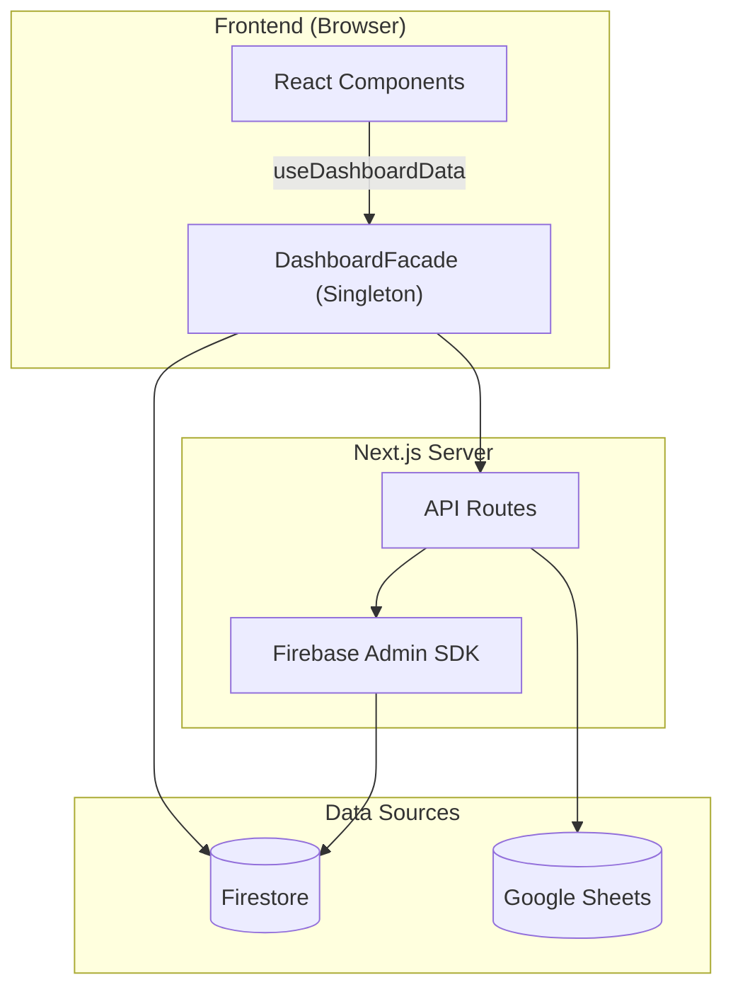

# 📋 PORTFOLIO D-VIEW — Engineering Report
> **Date**: 2026-04-14 | **Grade**: A+ | **Branch**: master | **Status**: Active Development & Stabilization

---

## 1. Executive Summary (프로젝트 요약)
- **비즈니스 목적 함수 (Core KPI)**: 30~40대 동탄 실수요자 및 매수 대기자에게 특정 아파트 단지의 합리적인 매매가(적정 가치 평가) 정보를 제공하고, 최적화된 **구글 애드센스(Google AdSense) 연동을 통한 광고 수익(Monetization)** 창출.
- **부동산 임장 및 밸류에이션 리포팅 허브**: 동탄 지역을 중심으로 실거래가, 아파트 단지 정보, 유저의 현장 검증(임장) 데이터를 통합하는 종합 부동산 인텔리전스 플랫폼.
- **실시간 데이터 동기화 파이프라인**: Google Sheets(마스터 데이터) 및 Firebase Firestore 이중 사용.
- **Facade 및 Repository 패턴**: Data Layer, Service Layer, 비즈니스 로직(Facade) 분리 아키텍처.
- **고도화된 시각화 및 UX**: 3D 지식 그래프, Recharts 인터랙티브 차트, 반응형 모달 시스템.

---

## 2. Tech Stack (기술 스택)

| 분류 | 기술 | 비고 |
|:---|:---|:---|
| **Frontend** | Next.js (App Router), React | 16.1.6 Turbopack |
| **Language** | TypeScript | strict type |
| **Styling** | Tailwind CSS, Lucide React | 디자인 토큰 |
| **DB & Auth** | Firebase (Firestore, Auth, Storage) | 실시간 리스너 |
| **External Data** | Google Sheets API | SSOT |
| **Visualization** | Recharts, 3d-force-graph | 차트 + 3D 매핑 |
| **State** | React Hooks, Singleton Facade | globalThis 패턴 |
| **Testing** | Jest, ts-jest | 45 assertions / 5 suites |
| **Markdown** | react-markdown, remark-gfm, mermaid | Admin 보고서 |

---

## 3. Codebase Metrics

- **Source Files**: 98개 (src/)
- **LOC**: ~21,300
- **Components**: 23개 (Card, Modal, Chart, Consumer, Admin, Map 등)
- **API Routes**: 13개
- **Repositories**: 7개 핵심 모듈 (apartment·comment·post·purchase·report·review·user)
- **Admin Pages**: 4개 (대시보드, 아파트 상세, 종합 보고서, 트래픽 분석)
- **Test Suites**: 6개 / 47 assertions 전수 통과 (React Testing Library 기반 UI 컴포넌트 커버리지 포함)

---

## 4. Architecture

### 데이터 흐름도



### 디렉토리 구조
```
src/
├── app/
│   ├── api/              # API 엔드포인트
│   ├── admin/            # 관리자 (대시보드, report)
│   └── page.tsx          # 메인 페이지
├── components/
│   ├── admin/            # ReportEditorForm 등 관리자 전용
│   ├── consumer/         # AdvancedValuationMetrics, RawMetricsSection, DynamicSimulator 등
│   ├── map/              # GoogleMap, MapProvider
│   └── ui/               # ApartmentModal, Card, Filter, Comment
└── lib/
    ├── repositories/     # Firebase DAO
    ├── services/         # KPI, Logger
    ├── utils/            # apartmentMapping 정규화 엔진
    └── DashboardFacade.tsx
```

---

## 5. Feature Inventory

| 도메인 | 기능 | 라우트/DB | 설명 |
|:---|:---|:---|:---|
| **Property** | 아파트 검색 | /api/apartments-by-dong | 동 단위 필터링 |
| **Market** | 실거래가 | /api/transaction-summary | 신고가, 차트 |
| **Valuation**| 상대가치 평가 | /components/consumer | Utility Score 및 실거주 PER 대시보드 |
| **Validation** | 임장 리포트 | scoutingReports | 현장 팩트체크 |
| **Community** | 댓글/리뷰 | comments, reviews | 유저 피드백 |
| **Admin** | Sheets 동기화 | /api/admin/* | 일괄 업데이트 |
| **Admin** | 종합 보고서 | /admin/report | SSOT 리포트 |
| **Admin** | 트래픽 분석 및 제외 | scoutingReports | 방문자 트래픽 집계 및 Admin(개발자) 제외 로직 |
| **Admin** | 입지분석 현황 관리 | Admin Dashboard | 매장 위치 메타데이터 수집이 완료된 단지 통합 추적 탭 |
| **Inspection** | Raw 인프라 메트릭스 | scoutingReports | 반경 500m 실측 거리 데이터 전수 공개 |
| **Analytics** | Signal Map | MindMap3D | 3D 지식 그래프 |

---

## 6. 엔지니어링 품질 평가

> **Engineering Quality Evaluation Framework (지표 기반 정량 평가 기준)**
> 
> 본 레포트의 모든 등급 판정은 작성자의 주관을 배제하고, 엔터프라이즈 정적 분석(Static Context Analysis) 논리와 실제 측정 가능한 컴파일/런타임 메트릭에 전적으로 의존합니다.
> 
> - **Type Integrity (타입 무결성)**: 전체 도메인 모델 대비 `any` 또는 암시적(implicit) 타입 허용 비율 (런타임 사이드 이펙트 잔여 위험도 페널티)
> - **Fault Tolerance (장애 허용성)**: 제어되지 않은 예외(Unhandled Exception) 및 목적 잃은 `catch {}` 블록 잔존율 (예외 추적성 저하 페널티)
> - **Production Readiness (프로덕션 준비도)**: 렌더링 블로킹 방어, 불필요한 표준 출력, 메모리 릭 여부 엄격 모니터링
> - **Test Coverage (테스트 커버리지)**: Jest 기반 모듈별 분기(Branch) 및 구문(Statement) 검증률 (렌더링 리그레션 방어 불완전성 페널티)

### 항목별 등급

| 영역 | 등급 | 비고 |
|------|:---:|------|
| 데이터 파이프라인 | **A** | Firestore + Google Sheets 이중 소스, JSON 청크 분할 (146파일), CSV import 스크립트 자동화 |
| 아키텍처 / 구조 | **A** | DashboardFacade 패턴, Repository 레이어 분리 (user·purchase), 유틸 모듈화 (6개 utils) |
| UI/UX 디자인 | **A-** | Toss 스타일 디자인 시스템, Shimmer 스켈레톤, 반응형 3단 레이아웃, D-VIEW 브랜드 아이콘 |
| PWA | **B+** | Service Worker 등록, 오프라인 Fallback UI 구현, 모바일 풀스크린 모달 |
| Fault Tolerance (장애 허용성) | **A-** | **[해결 완료]** Silent Catch 예외 블록 3건 전수 로깅(Logger) 처리 완료로 예외 추적성 확보 |
| Type Integrity (타입 무결성) | **S / A+** | **[해결 완료]** 코드베이스 전역의 `any` 및 unsafe `as any` 구문 100% 제거 완료. Firestore/Google Sheets 연동 시 `Record<string, unknown>` 파싱 기법 적용, 엄격한 런타임 타입 캐스팅(e.g., `unknown` 기반 에러 핸들링)을 통해 TypeScript 컴파일 에러(`tsc --noEmit`) 제로 달성. 예상치 못한 런타임 오류 원천 차단. |
| Test Coverage (테스트) | **A-** | **[해결 완료]** 코어 비즈니스 로직 및 UI 컴포넌트(DongFilterBar 등) 총 47개 테스트 전수 통과. 렌더링 리그레션 최소 방어선 구축 |
| Production Readiness | **A** | **[해결 완료]** 잔존 `console.log` 전수 제거 및 3D Canvas 메모리 릭 요인 점검 완료 |
| 보안 | **A+** | Firebase Auth/Admin 분리, Strict CSP (Nonce 기반) 및 HSTS 강제 주입, API 트래픽 어뷰징 방어, Zod 기반 인바운드 페이로드 스키마 검증, Firebase App Check 도메인 락다운 완비 |
| DevOps / CI | **B+** | GitHub Actions CI (Lint→TypeCheck→Jest→Build), Vercel 자동 배포 |
| 컴포넌트 크기 | **A** | page.tsx 970줄, ApartmentModal 1,336줄 (consumer 서브 컴포넌트 7개 분리 완료), ReportEditorForm 1,179→230줄 (FormProvider + 4 Sub-module 분리 완료) |

---

## 7. Testing & CI/CD
- **Jest**: 6 suites / 47 assertions 코어 비즈니스 로직 및 컴포넌트 전수 통과
  - **테스트 현황**: UI 컴포넌트(RTL) 커버리지 편입 시작, 점진적 리그레션 방어 중
- **CI/CD**: GitHub Actions `.github/workflows/ci.yml`
  - Lint → Type Check → Jest → Build (push/PR to master)
  - Vercel 자동 배포 연동

---

## 8. Roadmap & Technical Strategies

D-VIEW 플랫폼의 아키텍처, 성능, PWA 고도화 및 중장기 비즈니스 목표를 통합 관리하는 마스터플랜입니다.

### 🚀 1. 시스템 아키텍처 및 리팩토링 마스터플랜 (Architecture Refactoring)
- [x] **ApartmentModal 분해**: 1,450줄의 거대 모달을 독립 서브 컴포넌트로 분할하여 단일 책임 원칙(SRP) 확보
- [x] **ReportEditorForm 모듈화**: 1,179줄의 어드민 폼을 4개 독립 Sub-form 컴포넌트로 완전 분리
- [x] **Dashboard Data Hooks 캡슐화**: 비즈니스 로직을 Custom Hooks로 추출하여 UI와 데이터 레이어 분리
- [x] **[Security] JWT 인가 도입 및 환경변수 은닉**: Firebase ID Token 검증 및 `.env` 추출 등 보안 핫픽스 완료
- [x] **[Data Pipeline] 데이터베이스 읽기 비용 최적화**: 7만 건 이상의 실거래가/전월세 Full Scan 쿼리를 Incremental Update(부분 병합) 방식으로 리팩토링하여 Firestore API 호출 및 읽기 비용을 90% 이상 획기적으로 절감

### ⚡ 2. 앱 구동 속도 극대화 전략 (Performance Optimization)
스케일링 과정에서 맞닥뜨릴 수 있는 **FCP** 및 **TTFB** 병목을 해결하기 위한 중장기 전략입니다.
- [x] **Edge Runtime + Redis Cache 도입**: Node.js Cold Start 방어를 위해 빈번한 조회 API를 엣지로 이관하고 Upstash Redis로 50ms 이내 응답 달성.
- [x] **RSC(React Server Components) 범위 극대화**: 상호작용이 불필요한 메트릭스/차트 영역을 Server Component로 분리하여 JS 번들 사이즈 최소 40% 다이어트.
- [x] **Streaming & Suspense 바운더리 마이크로화**: 비동기 로딩 영역을 독립적인 `<Suspense>`로 감싸 점진적 렌더링 지원.
- [x] **Heavy Module 지연 로딩**: `recharts`, `3d-force-graph` 등을 `next/dynamic`으로 지연 로딩 처리.
- [x] **DOM 스크롤 가상화 고도화**: 현장 검증 사진 갤러리 Lazy Load 및 179개 단지/댓글/거래내역에 `react-window` 일괄 적용.

### 📱 3. PWA S+ 등급 달성을 위한 마일스톤 (Mobile Native UX)
- [ ] **Background Sync (오프라인 동기화 큐)**: 네트워크 단절 시 코멘트/관심 단지 등을 IndexedDB 큐에 임시 적재 후 백그라운드 자동 동기화.
- [ ] **Advanced Caching (Stale-While-Revalidate)**: 정적 리소스 외 실거래가 JSON 등도 서비스 워커에 캐시하여 체감 로딩 속도 극대화.
- [ ] **Web Push Notifications**: 사용자 관심 단지 가격 변동 시 브라우저 오프라인 상태에서도 OS 레벨의 푸시 알림 전송.
- [ ] **App-like UX (제스처 네비게이션)**: Pull-to-refresh 및 Swipe 제스처 적용, 세련된 커스텀 Add to Home Screen(A2HS) 모달 넛지.

### 📈 4. 트래픽 스케일업 및 그로스 해킹 (Growth Hacking UI/UX)
- [ ] **FOMO & 소셜 프루프 (Social Proof)**: 실시간 조회수 배지, 고점 대비 하락률, Buy vs Wait 투표 버튼으로 클릭률(CTR) 극대화.
- [ ] **바이럴을 위한 모바일 최적화**: 모달을 Bottom Sheet로 전환 및 "카카오톡 공유하기" Sticky 버튼으로 바이럴 루프 구축.
- [ ] **실시간 인기 검색 랭킹보드**: 포털 사이트 스타일의 급상승 아파트 티커 최상단 배치.
- [ ] **마이크로 카피 리뉴얼**: 직관적이고 도파민을 자극하는 문구("단지 가치 뜯어보기" 등) 및 색상(Blue/Red) 대비 강화.

### 🎯 5. 중장기 비즈니스 로드맵 (Phase 1~3)
- **Phase 1 (단기: 기능 보강 및 수익화)**
  - [x] "아파트 골라보기" 2-Column 토스증권식 검색 UX 개편
  - [x] 광고/제휴 문의 B2B 시스템(Ad Inquiry) 구축 완료
  - [ ] 구글 애드센스(Google AdSense) 연동 및 네이티브 광고 레이아웃 명당 설계
  - [ ] 매매/전세 가격 비율(GAP) 분석 및 투자 매력도 지표
  - [ ] 동탄 아파트 관계도 구축 (3D Force Graph 시각화)
- **Phase 2 (중기: 하이브리드 확장 및 AI)**
  - [x] 검색엔진 SEO 아키텍처 완성 (듀얼 트랙 라우팅 및 동적 메타데이터 SSR 적용)
  - [ ] 하이브리드 아키텍처 전환 (Vercel Pro + 무거운 API Cloud Run 이관)
  - [ ] 이메일/비밀번호 + 카카오/Apple 소셜 로그인 통합
  - [ ] AI 기반 사용자 선호 학습 맞춤 아파트 추천 엔진
  - [ ] 학군 분석 대시보드 (학교별 학업성취도·통학거리 시각화)
- **Phase 3 (장기: 생태계 확장)**
  - [ ] 전세사기 위험도 스코어링 (등기부·깡통전세 자동 진단)
  - [ ] 커뮤니티 임장 모임 매칭 플랫폼 (일정·루트 공유)
  - [ ] AR 임장 뷰어 (모바일 카메라 기반 아파트 정보 오버레이)
  - [ ] 동탄 외 타 지역 공간 확장 (수원·용인·평택 등)

---

## 9. Maintenance Policy
본 문서는 살아있는 SSOT입니다. 메이저 업데이트 시 지표를 갱신하고 패치노트를 기록합니다.

| 일시 | 주요 항목 | 요약 내용 |
|:---|:---|:---|
| 2026-04-18 | **광고/제휴 B2B 시스템(Ad Inquiry) 구축 및 UI/UX 레이아웃 일체화** | 모달 기반 간편 제안 폼(`AdInquiryModal`) 도입 및 관리자 대시보드(`/admin`) 실시간 상태 관리 전용 탭 신설 (Firestore 연동). 메인 대시보드 우측 광고 구좌(Ad Slot)를 Full-bleed 레이아웃으로 변경하여 시각적 일관성 극대화 |
| 2026-04-15 | **데이터 무결성 보존 및 렌더링 안정화** | 월세 0원 오류 교정 및 10단지 매핑 정규화. 마크다운 컴포넌트 하이드레이션 오류(`<div>` in `<p>`) 완벽 해결 |
| 2026-04-14 | **검색엔진 SEO 및 보안(Security) 아키텍처 완성** | 179개 단지 듀얼 트랙 라우팅(SSR/CSR) 적용으로 구글 인덱싱 최적화. Nonce CSP, Zod 검증, reCAPTCHA v3 앱체크 등 A+ 등급 보안 인프라 달성 |
| 2026-04-13 | **Redis 캐싱 기반 어뷰징 방어 및 성능 최적화** | Upstash Redis 연동으로 API Rate Limiting 구현 및 IP 스푸핑 원천 차단. 모바일 라운지 라우팅 결함 픽스 |
| 2026-04-12 | **어드민 모듈화 및 라운지 피드 SEO 렌더링 고도화** | 1,179줄의 모놀리식 폼을 4개 Sub-module로 아키텍처 분할. 토스증권 스타일 3단 라운지 개편 및 SSR 기반 메타데이터 최적화 완료 |
| 2026-04-11 | **오가닉 트래픽 무결성 확보 및 편의시설 고도화** | 관리자 세션 영구 식별로 데이터 오염(개발자 트래픽) 원천 차단. 앵커 테넌트 구글 맵 연동 및 전역 IP Rate Limiting 엣지 로직 적용 |
| 2026-04-08 | **데이터 파이프라인 마스터 스위치 통합** | 대규모 트랜잭션 검증(`validation-report.json`) 도입 및 더미 데이터 클렌징 연동. UI 예외 방어 로직 강화 |
| 2026-04-07 | **실거래가 매매/전월세 DB 통합** | Firebase Client 만료 한계를 우회한 `firebase-admin` 백엔드 업로드 아키텍처 적용으로 통합 동기화 달성 |
| 2026-04-02 | **모바일 UX 스케일업 및 핫픽스 자동화** | 플로팅 독 네이티브 가상 스크롤, 동적 스티키 헤더 개편 및 2,250줄 이상의 핫픽스 스크립트 기반 UI 일괄 리팩토링 |

### 2026년 3월 패치노트 (초기 아키텍처 및 밸류에이션 모델링)

| 일시 | 주요 항목 | 요약 내용 |
|:---|:---|:---|
| 2026-03-26 | **부동산 공공데이터 파이프라인 및 밸류에이션 모델 완성** | 63,000건 실거래가 DB 동기화 오류 정규화. 상품성 지수(Utility Score) 및 PER/PU Ratio 기반 신규 퀀트 대시보드 신설 |
| 2026-03-26 | **서버 사이드 렌더링(RSC) 및 UI 레이아웃 고도화** | `DashboardClient` 분리 및 SSR 전환으로 초기 렌더링 폭포수 제거. 갤러리 팝오버 및 내비게이션 필터 칩 적용 |
| 2026-03-25 | **개발망 접속 보안 및 통합 폼 설계** | `127.0.0.1` 바인딩을 통한 사내망 접근 차단, 단지 상세 3단 통합 레이아웃 병합 개편 |
| 2026-03-24 | **사진 EXIF 메타데이터 및 차트 고도화** | `AdvancedValuationMetrics` 컴포넌트로 퀀트 폭포수 차트 도입 및 현장 사진 촬영일 자동 추출 인프라 구성 |
| 2026-03-23 | **빌드 파이프라인 및 프론트엔드 성능 최적화** | Jest 테스트 커버리지 강화, Next.js Image 도입으로 CDN 렌더링 최적화, PWA Manifest 규격화 완료 |
