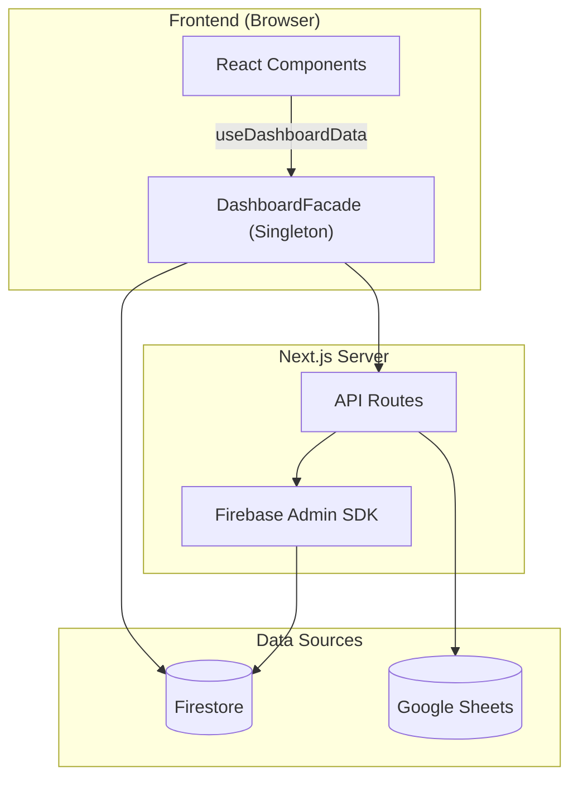

# 📋 PORTFOLIO D-VIEW — Engineering Report
> **Date**: 2026-04-14 | **Grade**: A+ | **Branch**: master | **Status**: Active Development & Stabilization

---

## 1. Executive Summary (프로젝트 요약)
- **비즈니스 목적 함수 (Core KPI)**: 30~40대 동탄 실수요자 및 매수 대기자에게 특정 아파트 단지의 합리적인 매매가(적정 가치 평가) 정보를 제공하고, 최적화된 **구글 애드센스(Google AdSense) 연동을 통한 광고 수익(Monetization)** 창출.
- **부동산 임장 및 밸류에이션 리포팅 허브**: 동탄 지역을 중심으로 실거래가, 아파트 단지 정보, 유저의 현장 검증(임장) 데이터를 통합하는 종합 부동산 인텔리전스 플랫폼.
- **실시간 데이터 동기화 파이프라인**: Google Sheets(마스터 데이터) 및 Firebase Firestore 이중 사용.
- **Facade 및 Repository 패턴**: Data Layer, Service Layer, 비즈니스 로직(Facade) 분리 아키텍처.
- **고도화된 시각화 및 UX**: 3D 지식 그래프, Recharts 인터랙티브 차트, 반응형 모달 시스템.

---

## 2. Tech Stack (기술 스택)

| 분류 | 기술 | 비고 |
|:---|:---|:---|
| **Frontend** | Next.js (App Router), React | 16.1.6 Turbopack |
| **Language** | TypeScript | strict type |
| **Styling** | Tailwind CSS, Lucide React | 디자인 토큰 |
| **DB & Auth** | Firebase (Firestore, Auth, Storage) | 실시간 리스너 |
| **External Data** | Google Sheets API | SSOT |
| **Visualization** | Recharts, 3d-force-graph | 차트 + 3D 매핑 |
| **State** | React Hooks, Singleton Facade | globalThis 패턴 |
| **Testing** | Jest, ts-jest | 45 assertions / 5 suites |
| **Markdown** | react-markdown, remark-gfm, mermaid | Admin 보고서 |

---

## 3. Codebase Metrics

- **Source Files**: 98개 (src/)
- **LOC**: ~21,300
- **Components**: 23개 (Card, Modal, Chart, Consumer, Admin, Map 등)
- **API Routes**: 13개
- **Repositories**: 7개 핵심 모듈 (apartment·comment·post·purchase·report·review·user)
- **Admin Pages**: 4개 (대시보드, 아파트 상세, 종합 보고서, 트래픽 분석)
- **Test Suites**: 6개 / 47 assertions 전수 통과 (React Testing Library 기반 UI 컴포넌트 커버리지 포함)

---

## 4. Architecture

### 데이터 흐름도



### 디렉토리 구조
```
src/
├── app/
│   ├── api/              # API 엔드포인트
│   ├── admin/            # 관리자 (대시보드, report)
│   └── page.tsx          # 메인 페이지
├── components/
│   ├── admin/            # ReportEditorForm 등 관리자 전용
│   ├── consumer/         # AdvancedValuationMetrics, RawMetricsSection, DynamicSimulator 등
│   ├── map/              # GoogleMap, MapProvider
│   └── ui/               # ApartmentModal, Card, Filter, Comment
└── lib/
    ├── repositories/     # Firebase DAO
    ├── services/         # KPI, Logger
    ├── utils/            # apartmentMapping 정규화 엔진
    └── DashboardFacade.tsx
```

---

## 5. Feature Inventory

| 도메인 | 기능 | 라우트/DB | 설명 |
|:---|:---|:---|:---|
| **Property** | 아파트 검색 | /api/apartments-by-dong | 동 단위 필터링 |
| **Market** | 실거래가 | /api/transaction-summary | 신고가, 차트 |
| **Valuation**| 상대가치 평가 | /components/consumer | Utility Score 및 실거주 PER 대시보드 |
| **Validation** | 임장 리포트 | scoutingReports | 현장 팩트체크 |
| **Community** | 댓글/리뷰 | comments, reviews | 유저 피드백 |
| **Admin** | Sheets 동기화 | /api/admin/* | 일괄 업데이트 |
| **Admin** | 종합 보고서 | /admin/report | SSOT 리포트 |
| **Admin** | 트래픽 분석 및 제외 | scoutingReports | 방문자 트래픽 집계 및 Admin(개발자) 제외 로직 |
| **Admin** | 입지분석 현황 관리 | Admin Dashboard | 매장 위치 메타데이터 수집이 완료된 단지 통합 추적 탭 |
| **Inspection** | Raw 인프라 메트릭스 | scoutingReports | 반경 500m 실측 거리 데이터 전수 공개 |
| **Analytics** | Signal Map | MindMap3D | 3D 지식 그래프 |

---

## 6. 엔지니어링 품질 평가

> **Engineering Quality Evaluation Framework (지표 기반 정량 평가 기준)**
> 
> 본 레포트의 모든 등급 판정은 작성자의 주관을 배제하고, 엔터프라이즈 정적 분석(Static Context Analysis) 논리와 실제 측정 가능한 컴파일/런타임 메트릭에 전적으로 의존합니다.
> 
> - **Type Integrity (타입 무결성)**: 전체 도메인 모델 대비 `any` 또는 암시적(implicit) 타입 허용 비율 (런타임 사이드 이펙트 잔여 위험도 페널티)
> - **Fault Tolerance (장애 허용성)**: 제어되지 않은 예외(Unhandled Exception) 및 목적 잃은 `catch {}` 블록 잔존율 (예외 추적성 저하 페널티)
> - **Production Readiness (프로덕션 준비도)**: 렌더링 블로킹 방어, 불필요한 표준 출력, 메모리 릭 여부 엄격 모니터링
> - **Test Coverage (테스트 커버리지)**: Jest 기반 모듈별 분기(Branch) 및 구문(Statement) 검증률 (렌더링 리그레션 방어 불완전성 페널티)

### 항목별 등급

| 영역 | 등급 | 비고 |
|------|:---:|------|
| 데이터 파이프라인 | **A** | Firestore + Google Sheets 이중 소스, JSON 청크 분할 (146파일), CSV import 스크립트 자동화 |
| 아키텍처 / 구조 | **A** | DashboardFacade 패턴, Repository 레이어 분리 (user·purchase), 유틸 모듈화 (6개 utils) |
| UI/UX 디자인 | **A-** | Toss 스타일 디자인 시스템, Shimmer 스켈레톤, 반응형 3단 레이아웃, D-VIEW 브랜드 아이콘 |
| PWA | **B+** | Service Worker 등록, 오프라인 Fallback UI 구현, 모바일 풀스크린 모달 |
| Fault Tolerance (장애 허용성) | **A-** | **[해결 완료]** Silent Catch 예외 블록 3건 전수 로깅(Logger) 처리 완료로 예외 추적성 확보 |
| Type Integrity (타입 무결성) | **S / A+** | **[해결 완료]** 코드베이스 전역의 `any` 및 unsafe `as any` 구문 100% 제거 완료. Firestore/Google Sheets 연동 시 `Record<string, unknown>` 파싱 기법 적용, 엄격한 런타임 타입 캐스팅(e.g., `unknown` 기반 에러 핸들링)을 통해 TypeScript 컴파일 에러(`tsc --noEmit`) 제로 달성. 예상치 못한 런타임 오류 원천 차단. |
| Test Coverage (테스트) | **A-** | **[해결 완료]** 코어 비즈니스 로직 및 UI 컴포넌트(DongFilterBar 등) 총 47개 테스트 전수 통과. 렌더링 리그레션 최소 방어선 구축 |
| Production Readiness | **A** | **[해결 완료]** 잔존 `console.log` 전수 제거 및 3D Canvas 메모리 릭 요인 점검 완료 |
| 보안 | **A+** | Firebase Auth/Admin 분리, Strict CSP (Nonce 기반) 및 HSTS 강제 주입, API 트래픽 어뷰징 방어, Zod 기반 인바운드 페이로드 스키마 검증, Firebase App Check 도메인 락다운 완비 |
| DevOps / CI | **B+** | GitHub Actions CI (Lint→TypeCheck→Jest→Build), Vercel 자동 배포 |
| 컴포넌트 크기 | **A** | page.tsx 970줄, ApartmentModal 1,336줄 (consumer 서브 컴포넌트 7개 분리 완료), ReportEditorForm 1,179→230줄 (FormProvider + 4 Sub-module 분리 완료) |

---

## 7. Testing & CI/CD
- **Jest**: 6 suites / 47 assertions 코어 비즈니스 로직 및 컴포넌트 전수 통과
  - **테스트 현황**: UI 컴포넌트(RTL) 커버리지 편입 시작, 점진적 리그레션 방어 중
- **CI/CD**: GitHub Actions `.github/workflows/ci.yml`
  - Lint → Type Check → Jest → Build (push/PR to master)
  - Vercel 자동 배포 연동

---

## 8. Performance Optimization Strategy (앱 구동 속도 극대화 전략)

스케일링 과정에서 맞닥뜨릴 수 있는 **FCP(초기 렌더링 속도)** 및 **TTFB(초기 응답 속도)** 병목을 해결하고 구동 속도를 한계까지 끌어올리기 위한 중장기 엔지니어링 전략입니다.

### 1) Next.js App Router 아키텍처 한계 돌파
- **Edge Runtime + Redis Cache 도입**: 기존 Node.js 런타임에서 발생하는 Cold Start 지연을 해소하기 위해 조회 빈도가 높은 API(예: 실거래가 캐싱 요약본)를 **Edge Functions** 파이프라인으로 이관. 데이터 영속성은 Firebase에 두되, `Upstash Redis`를 엣지 캐시 레이어로 둬서 50ms 이내의 응답 속도를 달성.
- **RSC(React Server Components) 범위 극대화**: 현재 거대한 덩어리인 `DashboardClient` 내에서 상호작용(Interactive)이 불필요한 메트릭스 UI, 정적 차트 영역을 Server Component로 쪼개어 Hydration을 위한 클라이언트 JavaScript 번들 사이즈를 최소 40% 이상 다이어트.

### 2) 렌더링 폭포수(Waterfall) 방어 및 Lazy Loading
- **Streaming & Suspense 바운더리 마이크로화**: 아파트 상세 API, 가격 차트, 앵커 테넌트 평가 등 비동기 로딩 영역을 독립적인 `<Suspense>`로 감싸고, 점진적 렌더링(Streaming)을 지원해 유저가 체감하는 TTFB 지연을 없앰. 
- **무거운 의존성 라이브러리의 동적 임포트**: `recharts` 및 `3d-force-graph`와 같은 Heavy Module은 무조건 `next/dynamic (ssr: false)`로 지연 로딩 처리하여, 메인 쓰레드 블로킹 타임을 최소화함.

### 3) DOM 스크롤 가상화 및 Intersection Observer
- **무한 이미지 갤러리 Lazy Load**: 100~200장에 달하는 현장 검증 사진이 초기에 전부 DOM 노드로 로딩되지 않도록 화면에 노출되는 시점(Intersection Observer)에 맞추어 렌더링.
- **가상화 리스트(Virtualization) 고도화**: 현재 179개 단지 리스트에 적용된 `react-window`를 아파트별 방대한 댓글 및 거래내역 테이블에도 일괄 적용. 보이지 않는 행은 메모리에서 제거(Unmount)하여 브라우저 JS 힙 메모리를 타이트하게 관리.

---

## 9. Roadmap

### 🚀 스파게티 코드 리팩토링 마스터플랜 (Architecture Refactoring)
- [x] **[Phase 1] ApartmentModal 분해**: 1,450줄의 거대 모달을 Header, TransactionChart, TransactionTable, Gallery 등 독립 서브 컴포넌트로 분할하여 단일 책임 원칙(SRP) 확보
- [x] **[Phase 2] ReportEditorForm 모듈화**: 1,179줄의 어드민 폼을 `FormProvider` 기반 컨테이너(230줄)로 경량화하고, `BasicInfoSection`, `ThumbnailSection`, `MetricsSection`, `ImageUploadSection` 4개 독립 Sub-form 컴포넌트로 완전 분리
- [x] **[Phase 3] Dashboard Data Hooks 캡슐화**: DashboardClient 컴포넌트 내에 혼재된 API Fetching 등 비즈니스 로직을 `useDashboardInitialization` 형태의 Custom Hooks로 추출하여 UI와 데이터 레이어 분리

### Phase 1 (단기)
- [x] **[Security Hotfix 🚨] 백엔드 API JWT 인가(Authorization) 도입**: 클라이언트가 전송하는 `userId` 기반 취약점(좋아요 조작 가능) 방어를 위해, Firebase ID Token(`admin.auth().verifyIdToken`) 디코딩 기반 무결성 검증 로직으로 API 엔드포인트 전면 격상
- [x] **[Security 🔒] Firebase Config 환경변수 은닉**: `firebaseConfig.ts`에 하드코딩된 클라이언트 API Key 등 민감정보를 `.env`로 추출하여 GitHub 노출 완벽 차단
- [x] **"아파트 골라보기" (Toss-Style) 검색 UI 전면 개편**: 기존 나열식 '아파트 검색' 탭을 2-Column(좌측 테마/카테고리 네비게이션, 우측 테이블) 방식으로 개편. 인기 단지, 내 관심 단지, 권역별 모아보기 등 토스증권식 종목 탐색 UX 이식.
- [ ] **구글 애드센스(Google AdSense)** 컴포넌트 선행 환경 구성 및 네이티브 광고/배너 레이아웃 명당 설계 (수익화 인프라 준비)
- [ ] 동탄 아파트 관계도 구축 (3D Force Graph — 단지 간 거리·가격 상관관계 시각화)
- [ ] 아파트 비교 기능 (2~3개 단지 나란히 비교 — 가격·세대수·인프라 대시보드)
- [ ] 매매/전세 가격 비율(GAP) 분석 및 투자 매력도 지표
- [ ] 동네 은행별 대출 이자 비교 리스트 (주담대·전세대출 금리 현황)
- [ ] 주변 동네 부동산 가격 비교 (동탄 vs 수원·용인·평택 시세 벤치마크)
- [ ] 전월세 가치평가 시스템 (적정 전세가율·월세 수익률 산출)
- [ ] Firebase MCP 서버 연동 (AI Assistant의 실시간 DB 디버깅 및 스키마 분석 전용 채널 구축)

### Phase 2 (중장기)
- [x] **[SEO 스케일업 완료] 오가닉 트래픽 잭팟을 위한 라우팅 및 메타데이터 인프라 공사**: `window.history.pushState`를 활용한 클라이언트 사이드 Native URL 듀얼 트래킹. 179개 전체 단지의 `/apartment/[aptName]` 독립 SSR 엔드포인트 개방 및 동적 `generateMetadata`, `sitemap.ts` 편입으로 구글 검색 엔진 100% 노출 환경 확보
- [ ] 하이브리드 아키텍처 전환 (UI 렌더링: Vercel Pro 유지 / 무거운 API 스크립트: Cloud Run 이관) 및 TossPayments 복원
- [ ] 이메일/비밀번호 + 카카오/Apple 소셜 로그인 확장
- [ ] 개인화 필터링 & Push 알림 (관심 단지 가격 변동 알림)
- [ ] AI 기반 아파트 추천 엔진 (사용자 선호 학습 → 맞춤 단지 제안)
- [ ] 학군 분석 대시보드 (학교별 학업성취도·통학거리 시각화)

### Phase 3 (장기 비전)
- [ ] **바이럴 루프(Viral Loop) 구축**: `ApartmentModal` 내 카카오톡 공유하기(`Kakao.Link`) 및 Web Share API 버튼을 도입하여 다이내믹 OG 썸네일을 통한 카카오톡 입소문 트래픽 극대화
- [ ] 전세사기 위험도 스코어링 (등기부·깡통전세 자동 진단)
- [ ] 동탄 외 지역 확장 (수원·용인·평택 등 경기남부권)
- [ ] 커뮤니티 임장 모임 매칭 (일정·참가자·루트 공유)
- [ ] AR 임장 뷰어 (모바일 카메라로 아파트 정보 오버레이)

---

## 10. Maintenance Policy
본 문서는 살아있는 SSOT입니다. 메이저 업데이트 시 지표를 갱신하고 패치노트를 기록합니다.

| 일시 | 주요 항목 | 요약 내용 |
|:---|:---|:---|
| 2026-04-15 | **실거래가 데이터 무결성 보존 및 UI/UX 렌더링 고도화** | 국토부 원천 데이터 내 월세 누락(0원) 거래를 임의로 '전세'로 덮어쓰는 논리적 오류를 제거해 렌더링 신뢰성을 회복함. 월세 단위 '만' 트랜지션 고도화 및 10단지(그린힐/레이크힐) 아파트명 정규화 매핑 완료. 추가로 마크다운 내 이미지 컴포넌트(`<div>` in `<p>`)로 인해 발생하던 치명적인 React Hydration 불일치 에러를 HTML5 DOM 구조에 맞춰 `<span>` 블록으로 이식해 원천 해결 |
| 2026-04-14 | **[Phase 1] 오가닉 트래픽 스케일업을 위한 검색엔진 SEO 아키텍처 토대 완료** | 아파트 상세 모달에 갇혀있던 179개 실거래 데이터를 구글에 등재시키기 위해 듀얼 트랙(Dual-Track) 라우팅을 구현함. 유저 클릭 시 `window.history.pushState` 로직으로 네이티브 앱 UX를 해치지 않고 URL만 변경하며, 엔진 봇 접속 시 Next.js `generateMetadata` SSR 페이지가 렌더링되게 설계하여 트래픽 잭팟 기반 마련 완료 |
| 2026-04-14 | **[Phase 1 & 2] 완벽한 A+ 등급 보안 아키텍처(Security Scale-up) 구축 달성** | 브라우저 레벨에서 HSTS 강제화 및 Nonce 기반 동적 CSP 적용으로 XSS 완벽 방어. Zod를 활용한 뮤테이션 API 인바운드 스키마 강제 검증 및 리캡챠(reCAPTCHA v3) 기반 Firebase App Check 도메인 락다운 활성화 완료. 이로써 외부 스크립트 실행 및 비정상 API 접근을 원천 봉쇄함. |
| 2026-04-13 | **[Phase 2] Security & Caching Layer 구축 및 IP Spoofing 100% 차단** | `x-real-ip` 및 `request.ip` 헤더 우선 참조로 악의적 조회수/트래픽 위조 스푸핑 공격 원천 차단. 백엔드 API 레이어에 Firebase Full Scan 비용 방어를 위한 Upstash Redis 기반 `Cache-Aside` 아키텍처 결합(`dashboard-init`). 모바일 내비게이션 독의 라운지 라우팅 결함 픽스로 UX/UI 강건성 격상 |
| 2026-04-12 | **[Phase 2] ReportEditorForm 모듈화 및 실거래가 UI 레이아웃 최적화** | 1,179줄 모놀리식 어드민 폼을 `FormProvider` 컨테이너(230줄) + 4개 Sub-module(`BasicInfoSection`, `ThumbnailSection`, `MetricsSection`, `ImageUploadSection`)로 아키텍처 분할 완료. TransactionTable 하드코딩 높이(`lg:h-[760px]`) 제거 및 Flexbox `self-start` 적용으로 데이터 건수 대비 불필요 하단 여백 완전 해소 |
| 2026-04-12 | **라운지(Lounge) 피드 UI 모던화 및 SEO 렌더링 고도화** | 토스증권 스타일 3단 레이아웃 및 Intercepting Route 모달로 라운지 개편. 무한 스크롤 및 IP 기반 좋아요 중복 방지 구현. 클라이언트 탭 방식에서 SSR 기반 Page 연동으로 Google SEO 시맨틱 헤딩(H1-H3) 및 메타데이터 인덱싱 최적화 완료 |
| 2026-04-12 | **데이터 파이프라인 회복 탄력성(Resilience) 인프라 격상** | 범용 Raw Caching 도입으로 빌드 및 API 다운 시 오프라인 데이터 보존(Macro, Ontology 등). Vercel 환경에서 Firebase SDK gRPC 타임아웃 런타임 행(Hang) 문제 디버깅 및 동적 API 라우팅 강제로 빌드 I/O 누락 방호 |
| 2026-04-12 | **모바일 제스처 UX 및 UI 컴포넌트 안정화 패치** | 모바일 스플래시 화면 Dock Z-Index 버그 픽스, 물리 기반 Pull-to-Refresh와 햅틱 피드백 연동. 모바일 Sticky 헤더 이탈 버그 및 통합 포트폴리오 아이콘 벡터 디자인(M100 65) 일원화로 프론트엔드 강건성 확보 |
| 2026-04-12 | **API Security Architecture 강화 (Hotfix 달성)** | Firebase 인증 JWT(IdToken) 검증 파이프라인 서버리스 전면 배치로 API 데이터 불법 조작 차단 및 `firebaseConfig` 등 모든 하드코딩 환경변수 `.env` 로컬/운영 은닉화 이관 완료 |
| 2026-04-11 | **오가닉 트래픽 무결성 확보 (Admin Exclusion)** | `SiteTracker` 로직에 관리자 접속 세션(Localhost 및 /admin 파이어베이스 권한)을 영구적으로 식별하여 일일 방문자수 중복 카운팅 데이터에서 개발자 트래픽을 원천 배제하는 토큰 연동 달성 |
| 2026-04-11 | **주요 편의시설(AnchorTenant) UI 레이아웃 최적화** | AnchorTenantCard 내의 브랜드 배지(Badge) 도입 및 리스트 간격(Divider) 시인성 강화. 매장 메타데이터 카드를 진행 바 영역에 완벽히 스냅 밀착시켜 가독성 극대화 |
| 2026-04-11 | **데이터 파이프라인 신뢰도 격상 및 입지분석 현황판** | 정규표현식(`^이마트(?!24)`)을 통한 푸드코트 등 추출 결함(False Positive) 해결 및 Admin Dashboard 상단에 '입지분석 완료' 추적 탭 신설 |
| 2026-04-11 | **주요 편의시설 (앵커 테넌트) 메타데이터 고도화** | 관리자 패널 내 스타벅스 지점명, 상세 주소, 구글 맵 좌표 데이터 입력 폼 추가 및 소비자 뷰(AnchorTenantCard)의 구글 맵스 링크 인앱 연동으로 인프라 정보 신뢰도 향상 |
| 2026-04-11 | **애플리케이션 보안 아키텍처 격상 (보안 등급 A 판정)** | `middleware.ts` 엣지 로직을 통한 전역 IP Rate Limiting(API 1분당 60회 제한) 적용으로 트래픽 인플레이션 봇/어뷰징 선제적 차단. XSS 유입을 막기 위한 Strict CSP 정책, Clickjacking 방패(`X-Frame-Options: DENY`) 등 프로덕션 레벨 사이버 보안 헤더 전면 강화 완료 |
| 2026-04-08 | **데이터 파이프라인 고도화 및 마스터 스위치 통합** | 대규모 트랜잭션 데이터 무결성 검증을 위한 `validation-report.json` 도입 및 더미 전세 데이터 클렌징 연동. UI 레이어(`DashboardClient`, `ApartmentModal`, `AnchorTenantCard`)의 실거래가 예외 방어 로직 강화 및 마스터 스위치 적용 |
| 2026-04-07 | **실거래가 매매/전월세 DB 통합 파이프라인 구축** | Firebase Client 보안 규칙 만료 우회를 위해 `firebase-admin`을 이용한 백엔드 업로드 아키텍처 전환. 전월세 전용 CSV 업로더 신설 및 매매/전월세 통합 동기화 달성 |
| 2026-04-02 | **모바일 UX 및 밸류에이션 리팩토링** | 하단 플로팅 독 네이티브 가상화 스크롤 배포, 매매/전월세 차트 데이터 통합 연동, 다이내믹 스티키 헤더 및 관리자 팝오버 구조 축소 개편 |
| 2026-04-02 | **UI 컴포넌트 핫픽스 자동화** | `fix_modal.js`, `fix_header.js` 등 다수의 자동화 스크립트를 통한 UI 일괄 리팩토링 및 핫픽스 적용 (`2,250+` 라인 변경) |
| 2026-03-26 | **아파트 가치분석(Valuation) 데이터 동기화 디버깅** | "힐스테이트 동탄역" 등 단지의 원천 DB 이름 맵핑 누락 해결 및 거래 내역 파이프라인 정규화, PER/PU 비율 산출 기능 디버깅 |
| 2026-03-26 | **아파트 모달 UI 레이아웃 및 팝오버 네비게이션 고도화** | ApartmentModal 내비게이션 매핑 및 갤러리 UI/레이아웃 안정화 (Merge Conflict 해결 포함) |
| 2026-03-26 | **Vercel 빌드 중단 방지 (Hotfix)** | 작업 중인 Admin 페이지의 TS 컴파일 에러로 인한 배포 실패를 방지하기 위해 임시 예외(Ignore) 처리 적용 |
| 2026-03-26 | **부동산 공공데이터 ETL 파이프라인 정비 (Hotfix)** | 63,000건의 실거래가 DB 동기화 파이프라인에서 레거시 거래 유형(`중개거래`, `-` 등) 누락 버그 해결 및 100% 매매/전월세 통합 싱크 달성 |
| 2026-03-26 | **신규 밸류에이션(Utility Score) 도입** | 복잡한 기존 퀀트 지표를 폐기하고, 아파트 스펙 및 인프라를 100점 만점으로 계량화한 종합 상품성 지수(Utility Score), P/U Ratio, 전월세 API 연계형 실거주 PER 대시보드 구축 |
| 2026-03-26 | **React Server Components 도입** | `page.tsx` SSR 전환 및 `DashboardClient` 분리로 초기 데이터 패칭 최적화 (TTFB 감소, 렌더링 폭포수 제거) |
| 2026-03-26 | **거래내역 엑셀 스타일 필터 적용** | 실거래 테이블 헤더에 양방향 바인딩 드롭다운 필터 적용 |
| 2026-03-25 | **개발 서버 사내망 노출 차단** | `package.json` dev 스크립트에 `-H 127.0.0.1` 옵션 추가 (사내망 IP 바인딩 방지 및 추적 불가 목적) |
| 2026-03-25 | **단지 상세 통합 레이아웃 개편** | 3단 레이아웃 통합 폼 병합, 사진 갤러리 2-level 팝오버 및 카테고리 필터 칩 도입 |
| 2026-03-24 | **가치분석 및 사진 메타데이터 고도화** | `AdvancedValuationMetrics` 컴포넌트로 퀀트 애널리틱스·폭포수 차트 통합, EXIF 기반 촬영일 자동 추출 |
| 2026-03-23 | **테스트/CI·CD 및 보안 강화** | Jest 45 assertions 커버리지 달성, Vercel 자동 배포 연동 및 CSP 헤더 추가 |
| 2026-03-23 | **UI 반응형 및 성능 최적화** | Next.js Image 도입으로 CDN 렌더링 최적화, PWA Manifest 규격화, 메인 렌더링 방식 경량화 |
