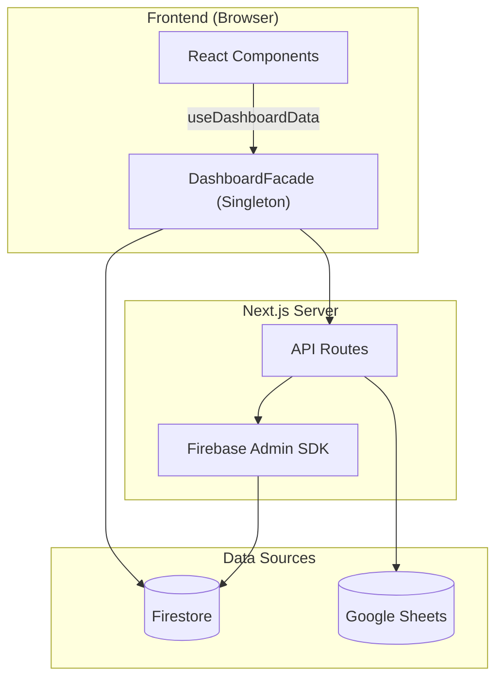

# 📋 PORTFOLIO D-VIEW — Engineering Report
> **Date**: 2026-03-23 | **Grade**: A | **Branch**: master | **Status**: Active Development & Stabilization

---

## 📝 Patch Notes (변경 이력)

| 일시 | 항목 | 내용 |
|:---|:---|:---|
| 2026-03-23 23:38 | **현장 촬영 일자 독립 적용** | 리포트 작성일과 분리된 `scoutingDate` DB 스키마 및 어드민 입력 폼 추가, 갤러리 헤더에 타임존 에러 없는 기준일자 표기 |
| 2026-03-23 23:29 | **PWA & Favicon 웹 표준 대응** | Next.js 14 `manifest.ts` 신규 생성 및 `layout.tsx` 명시적 메타데이터/뷰포트 선언 |
| 2026-03-23 23:25 | **이미지 CDN 렌더링 최적화** | Firebase 갤러리/풀스크린 이미지들에 `next/image` 컴포넌트 전면 도입 (자동 WebP 변환 및 지연 로딩) |
| 2026-03-23 18:30 | **밸류에이션 UI 통합 및 갤러리 개편** | 퀀트 애널리틱스와 폭포수 차트 탭 병합/경량화, 세로형 사진 갤러리를 카테고리별 가로 스와이프(Snap) UX로 전면 개편 |
| 2026-03-23 17:19 | **보고서 이름 변경** | `PORTFOLIO_DTDLS_REPORT.md` → `PORTFOLIO DVIEW - Engineering Report.md` |
| 2026-03-23 17:03 | **관리자 트래픽 분석 탭** | Admin 페이지에 `트래픽` 탭 신규 — scoutingReports 기반 단지별 조회수·관심 집계, 바 차트 + 정렬 기능 |
| 2026-03-23 16:52 | **면적 컬럼 헤더 동적 전환** | `ApartmentModal` 거래 테이블 헤더 `m²/평` 토글에 따라 동적 변경 |
| 2026-03-23 16:50 | **임장 배지 통일** | 카드 배지 `✅` → `FileText` 아이콘 + 앰버 스타일 (`bg-[#fff8e1]`), 헤더 `2개 리포트` 배지와 통일 |
| 2026-03-23 16:46 | **평당가격 공급면적 기준 수정** | `typeM2` 숫자 파싱 → 공급m² × 0.3025 = 공급평형 → `avg1MPrice / supplyPyeong` 재계산, `typeMap·areaUnit` props 전달 누락 수정 |
| 2026-03-23 16:35 | **D-VIEW 서브타이틀 강조** | `D-VIEW` 파란 볼드 + `Dongtan Value Insight & Evaluation Window` 각 이니셜 동일 색상 강조 |
| 2026-03-23 16:34 | **면적 토글 표기 변경** | 토글 버튼 `면적 → m²`, 거래 테이블 헤더 `m²` 고정 적용 |
| 2026-03-23 13:10 | **테스트 커버리지 확충** | 16→45 assertions (5 suites), haversine·valuation·dongs·scoring 테스트 신규, stale 테스트 수정 |
| 2026-03-23 12:45 | **D-VIEW 브랜딩** | 아이콘 생성 (D + 상승 바차트), favicon·헤더 적용, 메타데이터 업데이트, 여백 축소 |
| 2026-03-23 12:33 | **UI 수정 + 모바일 모달 버그 수정** | 'by 임장크루' 삭제, D-VIEW 타이틀 적용, 모바일 풀스크린 모달 오버레이 추가 |
| 2026-03-23 12:27 | **실거래가 데이터 업데이트** | CSV 48건 import (3/17~3/20), Firestore + transaction-summary.ts 재생성 (146개 아파트, 63,233건) |
| 2026-03-23 12:17 | **CI/CD 파이프라인** | GitHub Actions CI workflow 신규 (린트 → 타입체크 → Jest → 빌드) |
| 2026-03-23 12:10 | **Google Sheets Write 고도화** | apartments-sync API 전체 필드 쓰기 확장, Admin 상세 페이지에 세대수/시공사/용적률/건폐율/주차/좌표 에디터 추가 |
| 2026-03-23 12:00 | **Anchor Tenant Metrics** | AnchorTenantCard 컴포넌트 신규, 앵커 테넌트 근접도 시각화 (바 차트 + 등급 + 종합 점수) |
| 2026-03-23 11:50 | **결제 기능 비활성화** | TossPayments SDK 제거, 프리미엄 콘텐츠 전면 공개 (Vercel Hobby Plan 대응) |
| 2026-03-23 11:47 | **구글 시트 자동 동기화** | 정적 dong-apartments.ts 대신 /api/apartments-by-dong API 연동, 정적 데이터는 폴백 유지 |
| 2026-03-23 11:47 | **정렬 로직 안정화** | 조회수/관심 정렬 시 같은 값에 가나다순 2차 정렬 추가, 여울동 힐스테이트 동탄역 데이터 삭제 |

---

## 1. Executive Summary (프로젝트 요약)
- **부동산 임장 및 밸류에이션 리포팅 허브**: 동탄 지역을 중심으로 실거래가, 아파트 단지 정보, 유저의 현장 검증(임장) 데이터를 통합하는 종합 부동산 인텔리전스 플랫폼.
- **실시간 데이터 동기화 파이프라인**: Google Sheets(마스터 데이터) 및 Firebase Firestore 이중 사용.
- **Facade 및 Repository 패턴**: Data Layer, Service Layer, 비즈니스 로직(Facade) 분리 아키텍처.
- **고도화된 시각화 및 UX**: 3D 지식 그래프, Recharts 인터랙티브 차트, 반응형 모달 시스템.

---

## 2. Tech Stack (기술 스택)

| 분류 | 기술 | 비고 |
|:---|:---|:---|
| **Frontend** | Next.js (App Router), React | 16.1.6 Turbopack |
| **Language** | TypeScript | strict type |
| **Styling** | Tailwind CSS, Lucide React | 디자인 토큰 |
| **DB & Auth** | Firebase (Firestore, Auth, Storage) | 실시간 리스너 |
| **External Data** | Google Sheets API | SSOT |
| **Visualization** | Recharts, 3d-force-graph | 차트 + 3D 매핑 |
| **State** | React Hooks, Singleton Facade | globalThis 패턴 |
| **Testing** | Jest, ts-jest | 16 assertions |
| **Markdown** | react-markdown, remark-gfm, mermaid | Admin 보고서 |

---

## 3. Codebase Metrics

- **Source Files**: ~80-100개 (src/)
- **LOC**: ~15,000-20,000
- **Components**: 35+ (Card, Modal, Chart, Layout 등)
- **API Routes**: 10개
- **Repositories**: 6개 핵심 모듈
- **Admin Pages**: 3개 (대시보드, 아파트 상세, 종합 보고서)
- **Test Suites**: 2개 / 16 assertions 전수 통과

---

## 4. Architecture

### 데이터 흐름도



### 디렉토리 구조
```
src/
├── app/
│   ├── api/              # API 엔드포인트
│   ├── admin/            # 관리자 (대시보드, report)
│   └── page.tsx          # 메인 페이지
├── components/
│   ├── dashboard/        # 대시보드 위젯
│   ├── features/         # ApartmentModal, Card, Filter, Comment
│   └── ui/               # 공통 UI
└── lib/
    ├── repositories/     # Firebase DAO
    ├── services/         # KPI, Logger
    ├── utils/            # apartmentMapping 정규화 엔진
    └── DashboardFacade.tsx
```

---

## 5. Feature Inventory

| 도메인 | 기능 | 라우트/DB | 설명 |
|:---|:---|:---|:---|
| **Property** | 아파트 검색 | /api/apartments-by-dong | 동 단위 필터링 |
| **Market** | 실거래가 | /api/transaction-summary | 신고가, 차트 |
| **Validation** | 임장 리포트 | scoutingReports | 현장 팩트체크 |
| **Community** | 댓글/리뷰 | comments, reviews | 유저 피드백 |
| **Admin** | Sheets 동기화 | /api/admin/* | 일괄 업데이트 |
| **Admin** | 종합 보고서 | /admin/report | SSOT 리포트 |
| **Admin** | 트래픽 분석 탭 | scoutingReports | 단지별 조회수·관심 집계 |
| **Analytics** | Signal Map | MindMap3D | 3D 지식 그래프 |

---

## 6. 엔지니어링 품질 평가

### 항목별 등급

| 영역 | 등급 | 비고 |
|------|:---:|------|
| 데이터 파이프라인 | **A** | Firestore + Google Sheets 이중 소스, JSON 청크 분할 (146파일), CSV import 스크립트 자동화 |
| 아키텍처 / 구조 | **A** | DashboardFacade 패턴, Repository 레이어 분리 (user·purchase), 유틸 모듈화 (6개 utils) |
| UI/UX 디자인 | **A-** | Toss 스타일 디자인 시스템, Shimmer 스켈레톤, 반응형 3단 레이아웃, D-VIEW 브랜드 아이콘 |
| PWA | **B+** | Service Worker 등록, 오프라인 Fallback UI 구현, 모바일 풀스크린 모달 |
| 에러 처리 | **B+** | Hydration 방어 (`suppressHydrationWarning`), 정규화 엔진 방어 코드, undefined 세이프가드 |
| 타입 안전성 | **A** | 전용 인터페이스 (StaticApartment·AptTxSummary·PremiumScores), strict null 체크 |
| 테스트 | **B+** | Jest 45 assertions / 5 suites (apartmentMapping·haversine·valuation·dongs·scoring) |
| 보안 | **B** | Firebase Auth (Google OAuth), Admin 권한 분리, credentials.json gitignore |
| DevOps / CI | **B+** | GitHub Actions CI (Lint→TypeCheck→Jest→Build), Vercel 자동 배포 |
| 컴포넌트 크기 | **B+** | page.tsx 889줄 (리팩토링 필요), ApartmentModal·ApartmentCard 컴포넌트 분리 완료 |

---

## 7. Testing & CI/CD
- **Jest**: 5 suites / 45 assertions (apartmentMapping·transaction-summary·haversine·valuation·dongs+scoring)
- **CI/CD**: GitHub Actions `.github/workflows/ci.yml`
  - Lint → Type Check → Jest → Build (push/PR to master)
  - Vercel 자동 배포 연동

---

## 8. Roadmap

### Phase 1 (단기)
- [x] ~~테스트 커버리지 확충~~ (16→45 assertions, 5 suites — haversine·valuation·dongs·scoring·apartmentMapping)
- [x] ~~데이터 검증 레이어~~ (가격 IQR 이상치·미등록 단지·면적/층수 범위·중복 탐지, 검증 리포트 자동 생성)
- [ ] 실거래가 자동 수집 자동화 (GitHub Actions cron → 국토부 API → Firestore)
- [x] ~~리스트 가상화~~ (react-window FixedSizeList — 179개 → ~17개 DOM 노드, 체감 속도 2~3배 향상)
- [ ] 동탄 아파트 관계도 구축 (3D Force Graph — 단지 간 거리·가격 상관관계 시각화)
- [ ] 아파트 비교 기능 (2~3개 단지 나란히 비교 — 가격·세대수·인프라 대시보드)
- [ ] 매매/전세 가격 비율(GAP) 분석 및 투자 매력도 지표
- [ ] 동네 은행별 대출 이자 비교 리스트 (주담대·전세대출 금리 현황)
- [ ] 주변 동네 부동산 가격 비교 (동탄 vs 수원·용인·평택 시세 벤치마크)
- [ ] 전월세 가치평가 시스템 (적정 전세가율·월세 수익률 산출)

### Phase 2 (중장기)
- [ ] E2E 테스트 (Playwright — 모달·정렬·필터 자동 검증)
- [ ] Vercel Pro Plan 전환 + TossPayments 유료 모델 복원
- [ ] Edge Function 전환 (서버리스 실행 시간 제한 완화)
- [ ] 이메일/비밀번호 + 카카오/Apple 소셜 로그인 확장
- [ ] 개인화 필터링 & Push 알림 (관심 단지 가격 변동 알림)
- [ ] AI 기반 아파트 추천 엔진 (사용자 선호 학습 → 맞춤 단지 제안)
- [ ] 학군 분석 대시보드 (학교별 학업성취도·통학거리 시각화)

### Phase 3 (장기 비전)
- [ ] 전세사기 위험도 스코어링 (등기부·깡통전세 자동 진단)
- [ ] 동탄 외 지역 확장 (수원·용인·평택 등 경기남부권)
- [ ] 커뮤니티 임장 모임 매칭 (일정·참가자·루트 공유)
- [ ] AR 임장 뷰어 (모바일 카메라로 아파트 정보 오버레이)

---

## 9. Maintenance Policy
본 문서는 살아있는 SSOT입니다. 메이저 업데이트 시 지표를 갱신하고 패치노트를 기록합니다.
