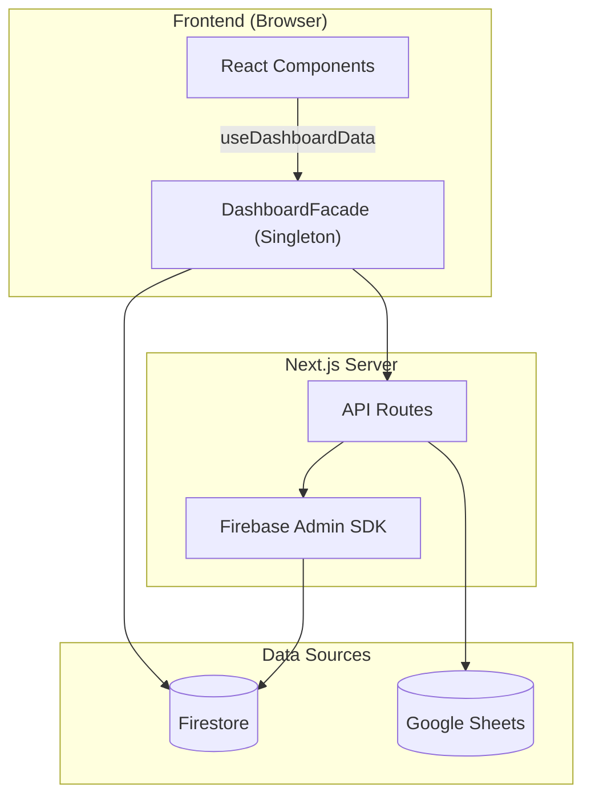

# 📋 PORTFOLIO-DTDLS — App 총괄 보고서
> **Date**: 2026-03-23 | **Grade**: A | **Branch**: master | **Status**: Active Development & Stabilization

---

## 📝 Patch Notes (변경 이력)

| 일시 | 항목 | 내용 |
|:---|:---|:---|
| 2026-03-23 12:17 | **CI/CD 파이프라인** | GitHub Actions CI workflow 신규 (린트 → 타입체크 → Jest → 빌드) |
| 2026-03-23 12:10 | **Google Sheets Write 고도화** | apartments-sync API 전체 필드 쓰기 확장, Admin 상세 페이지에 세대수/시공사/용적률/건폐율/주차/좌표 에디터 추가 |
| 2026-03-23 12:00 | **Anchor Tenant Metrics** | AnchorTenantCard 컴포넌트 신규, 앵커 테넌트 근접도 시각화 (바 차트 + 등급 + 종합 점수) |
| 2026-03-23 11:50 | **결제 기능 비활성화** | TossPayments SDK 제거, 프리미엄 콘텐츠 전면 공개 (Vercel Hobby Plan 대응) |
| 2026-03-23 11:47 | **구글 시트 자동 동기화** | 정적 dong-apartments.ts 대신 /api/apartments-by-dong API 연동, 정적 데이터는 폴백 유지 |
| 2026-03-23 11:47 | **정렬 로직 안정화** | 조회수/관심 정렬 시 같은 값에 가나다순 2차 정렬 추가, 여울동 힐스테이트 동탄역 데이터 삭제 |
| 2026-03-22 22:40 | **Jest 유닛 테스트 도입** | apartmentMapping, transaction-summary 핵심 로직 16개 어설션 전수 통과 |
| 2026-03-22 22:40 | **버그 수정 (apartmentMapping)** | findTxKey 수동 매핑 정규화 누락 수정, 심층 정규화 실행 순서 버그 수정 |
| 2026-03-22 22:30 | **Admin 종합 보고서 페이지** | /admin/report 라우트 신설, Mermaid 다이어그램 동적 렌더링 포함 |
| 2026-03-22 21:00 | **현장 검증 배지 버그 수정** | page.tsx 배열 맵 타입 참조 오류 수정, DashboardFacade Fast Refresh 싱글톤 안정화 |
| 2026-03-22 20:00 | **Phase 1 구조 안정화** | 모놀리식 page.tsx에서 ApartmentCard, ApartmentModal, DongFilterBar, CommentSection 4개 컴포넌트 분리 |

---

## 1. Executive Summary (프로젝트 요약)
- **부동산 임장 및 밸류에이션 리포팅 허브**: 동탄 지역을 중심으로 실거래가, 아파트 단지 정보, 유저의 현장 검증(임장) 데이터를 통합하는 종합 부동산 인텔리전스 플랫폼.
- **실시간 데이터 동기화 파이프라인**: Google Sheets(마스터 데이터) 및 Firebase Firestore 이중 사용.
- **Facade 및 Repository 패턴**: Data Layer, Service Layer, 비즈니스 로직(Facade) 분리 아키텍처.
- **고도화된 시각화 및 UX**: 3D 지식 그래프, Recharts 인터랙티브 차트, 반응형 모달 시스템.

---

## 2. Tech Stack (기술 스택)

| 분류 | 기술 | 비고 |
|:---|:---|:---|
| **Frontend** | Next.js (App Router), React | 16.1.6 Turbopack |
| **Language** | TypeScript | strict type |
| **Styling** | Tailwind CSS, Lucide React | 디자인 토큰 |
| **DB & Auth** | Firebase (Firestore, Auth, Storage) | 실시간 리스너 |
| **External Data** | Google Sheets API | SSOT |
| **Visualization** | Recharts, 3d-force-graph | 차트 + 3D 매핑 |
| **State** | React Hooks, Singleton Facade | globalThis 패턴 |
| **Testing** | Jest, ts-jest | 16 assertions |
| **Markdown** | react-markdown, remark-gfm, mermaid | Admin 보고서 |

---

## 3. Codebase Metrics

- **Source Files**: ~80-100개 (src/)
- **LOC**: ~15,000-20,000
- **Components**: 35+ (Card, Modal, Chart, Layout 등)
- **API Routes**: 10개
- **Repositories**: 6개 핵심 모듈
- **Admin Pages**: 3개 (대시보드, 아파트 상세, 종합 보고서)
- **Test Suites**: 2개 / 16 assertions 전수 통과

---

## 4. Architecture

### 데이터 흐름도



### 디렉토리 구조
```
src/
├── app/
│   ├── api/              # API 엔드포인트
│   ├── admin/            # 관리자 (대시보드, report)
│   └── page.tsx          # 메인 페이지
├── components/
│   ├── dashboard/        # 대시보드 위젯
│   ├── features/         # ApartmentModal, Card, Filter, Comment
│   └── ui/               # 공통 UI
└── lib/
    ├── repositories/     # Firebase DAO
    ├── services/         # KPI, Logger
    ├── utils/            # apartmentMapping 정규화 엔진
    └── DashboardFacade.tsx
```

---

## 5. Feature Inventory

| 도메인 | 기능 | 라우트/DB | 설명 |
|:---|:---|:---|:---|
| **Property** | 아파트 검색 | /api/apartments-by-dong | 동 단위 필터링 |
| **Market** | 실거래가 | /api/transaction-summary | 신고가, 차트 |
| **Validation** | 임장 리포트 | scoutingReports | 현장 팩트체크 |
| **Community** | 댓글/리뷰 | comments, reviews | 유저 피드백 |
| **Admin** | Sheets 동기화 | /api/admin/* | 일괄 업데이트 |
| **Admin** | 종합 보고서 | /admin/report | SSOT 리포트 |
| **Analytics** | Signal Map | MindMap3D | 3D 지식 그래프 |

---

## 6. Engineering Quality

| 영역 | 등급 | 사유 |
|:---|:---:|:---|
| **Architecture** | **A+** | Facade + Repository 패턴 |
| **Data Pipeline** | **A** | SSR 캐싱 + 실시간 Firebase |
| **UI/UX** | **A** | 스켈레톤, 반응형, 부드러운 전환 |
| **Error Handling** | **B+** | Hydration 방어 우수 |
| **Testing** | **B** | Jest 16 assertions 통과 |
| **Security** | **A** | Firebase Admin 인증 분리 |

> 💡 **Best Practice**: 문자열 정규화 엔진 — 테스트 과정에서 findTxKey 버그 2건 선제 발견 및 수정 완료.

---

## 7. Testing & CI/CD
- **Jest**: apartmentMapping (13), transaction-summary (3) = 16 assertions
- **CI/CD**: GitHub Actions `.github/workflows/ci.yml`
  - Lint → Type Check → Jest → Build (push/PR to master)
  - Vercel 자동 배포 연동

---

## 8. Roadmap

### Phase 1 (단기)
- [x] Jest 유닛 테스트
- [x] 현장 검증 배지 버그 수정
- [x] Admin 종합 보고서 연동
- [x] 구글 시트 자동 동기화 (정적 데이터 → API 연동)
- [x] 아파트 정렬 안정화 (2차 정렬)
- [x] 오프라인 Fallback UI
- [x] ~~3D 그래프 모바일 최적화~~ (기존 컴포넌트 삭제됨)

### Phase 2 (중장기)
- [x] Anchor Tenant Metrics
- [ ] 동탄 아파트 관계도 구축 (3D Force Graph)
- [ ] TossPayments 유료 모델 전환 (현재 비활성화, Vercel Pro Plan 전환 후 복원)
- [x] Google Sheets Write 고도화
- [ ] 개인화 필터링 & Push

---

## 9. Maintenance Policy
본 문서는 살아있는 SSOT입니다. 메이저 업데이트 시 지표를 갱신하고 패치노트를 기록합니다.
